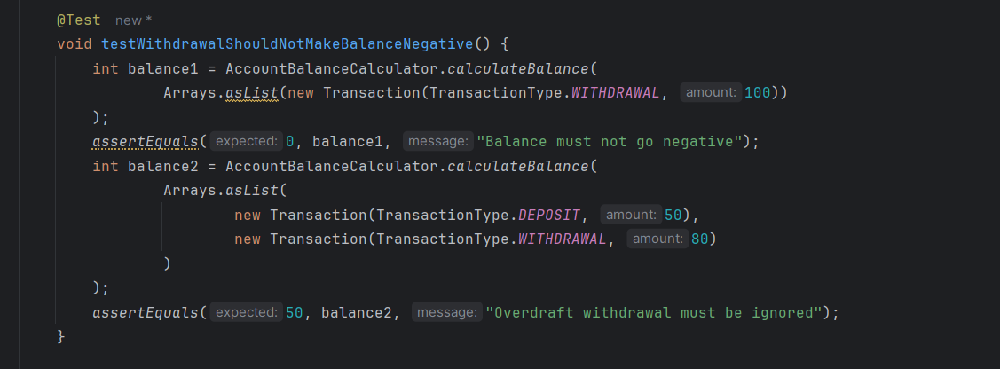
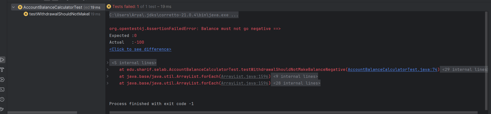
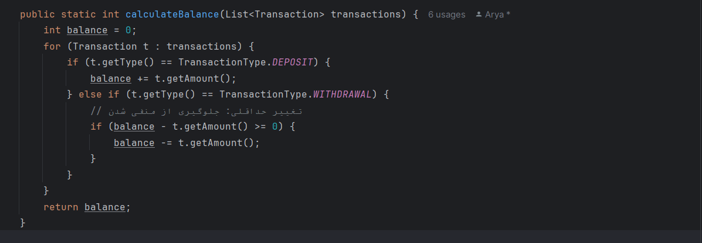
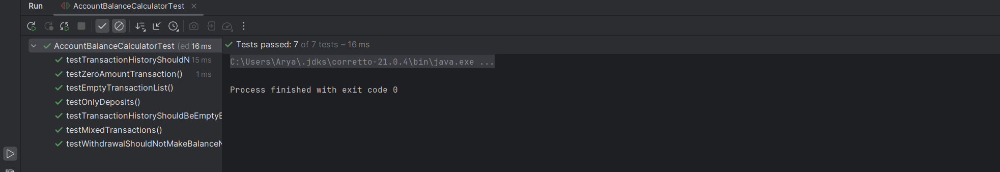

# مدیریت حساب بانکی

### پاسخ پرسش اول
**خطا:** متد `calculateBalance` قاعده‌ی «برداشت نباید باعث موجودی منفی شود» را رعایت نمی‌کند و بدون بررسی، مبلغ برداشت را از موجودی کم می‌کند. این موضوع می‌تواند در شرایطی مانند `[WITHDRAWAL 100]` یا `DEPOSIT 50 → WITHDRAWAL 80` باعث منفی شدن موجودی شود.  

### پاسخ پرسش دوم
برای آشکارسازی خطا، یک تست جدید اضافه شد که بررسی می‌کند اگر مبلغ برداشت بیش از موجودی حساب باشد، تراکنش نباید انجام شود و موجودی بدون تغییر باقی بماند.  
در پیاده‌سازی اولیه، چنین شرطی وجود نداشت و برداشت بدون بررسی انجام می‌شد.  
برای رفع این مشکل، در متد `calculateBalance` شرطی اضافه شد تا فقط زمانی برداشت انجام شود که موجودی کافی وجود داشته باشد؛ در غیر این صورت تراکنش نادیده گرفته می‌شود.  
با این تغییر، تست جدید و تمامی تست‌های فعال بخش اول با موفقیت پاس شدند.

