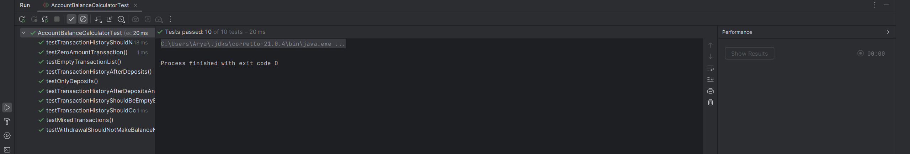
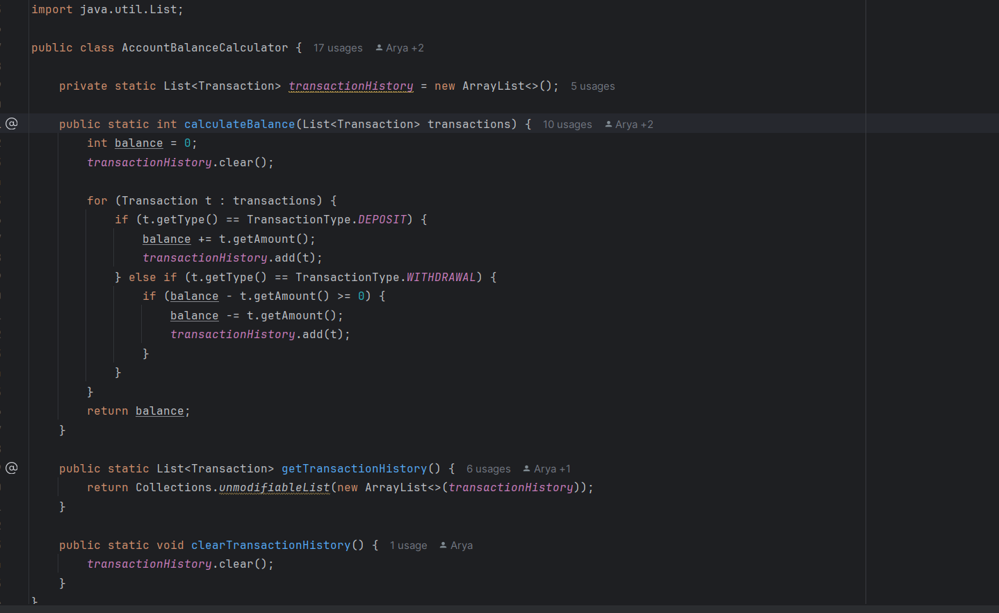

# مدیریت حساب بانکی

### پاسخ پرسش اول
**خطا:** متد `calculateBalance` قاعده‌ی «برداشت نباید باعث موجودی منفی شود» را رعایت نمی‌کند و بدون بررسی، مبلغ برداشت را از موجودی کم می‌کند. این موضوع می‌تواند در شرایطی مانند `[WITHDRAWAL 100]` یا `DEPOSIT 50 → WITHDRAWAL 80` باعث منفی شدن موجودی شود.  

### پاسخ پرسش دوم
برای آشکارسازی خطا، یک تست جدید اضافه شد که بررسی می‌کند اگر مبلغ برداشت بیش از موجودی حساب باشد، تراکنش نباید انجام شود و موجودی بدون تغییر باقی بماند.  
در پیاده‌سازی اولیه، چنین شرطی وجود نداشت و برداشت بدون بررسی انجام می‌شد.  
برای رفع این مشکل، در متد `calculateBalance` شرطی اضافه شد تا فقط زمانی برداشت انجام شود که موجودی کافی وجود داشته باشد؛ در غیر این صورت تراکنش نادیده گرفته می‌شود.  
با این تغییر، تست جدید و تمامی تست‌های فعال بخش اول با موفقیت پاس شدند.

### پاسخ پرسش سوم
نوشتن آزمون پس از کدنویسی می‌تواند باعث شود تست‌ها صرفاً برای تأیید کد موجود نوشته شوند و بخش‌هایی از منطق یا سناریوهای لبه‌ای (edge cases) اصلاً بررسی نشوند، چون ذهن برنامه‌نویس تحت تأثیر پیاده‌سازی فعلی قرار می‌گیرد.  
این موضوع احتمال باقی‌ماندن خطاهای پنهان را بالا می‌برد و در صورت تغییر طراحی یا بازنویسی بخشی از کد، تست‌ها نیز باید بازنویسی شوند که زمان‌بر و پرهزینه است.  
همچنین، چون خطاها دیرتر شناسایی می‌شوند، هزینه و دشواری رفع آن‌ها در مراحل پایانی توسعه به‌مراتب بیشتر خواهد بود.

### پاسخ پرسش چهارم
**نوشتن تست‌ها پیش از کدنویسی چگونه ساخت برنامه را تسهیل کرد؟**
- **شفاف‌سازی نیازمندی‌ها:** قبل از پیاده‌سازی، رفتارها دقیق و قابل اجرا تعریف شد (مثلاً جلوگیری از برداشت بیش از موجودی، و نگهداری تاریخچه‌ی آخرین محاسبه). این باعث شد حین کدنویسی تصمیم مبهم نداشته باشم.
- **بازخورد سریع و قابل اتکا:** هر تغییر کوچک را فوراً با اجرای تست‌ها سنجیدم؛ به‌جای دیباگ طولانی، خروجی سبز/قرمز دقیقاً نشان می‌داد کجا مشکل دارم.
- **طراحی ساده‌تر و ماژولار:** برای قابل‌تست‌بودن، متدها کوچک‌تر و وابستگی‌ها شفاف‌تر شدند؛ نتیجه‌اش کدی تمیزتر و قابل نگه‌داری‌تر بود.

### پاسخ پرسش پنجم
**مزایا و معایب روش ایجاد مبتنی بر آزمون (TDD) بر اساس تجربه‌ی این تمرین**

**مزایا**
- **کیفیت بالاتر:** با آزمون‌های ریز و هدفمند، باگ‌ها زود کشف می‌شوند و رگرسیون سخت‌تر رخ می‌دهد.
- **طراحی بهتر:** مجبور می‌شوی API/رفتار را از دید مصرف‌کننده تعریف کنی؛ کد ساده‌تر و cohesive می‌شود.
- **اعتماد در تغییر:** هنگام ریفکتور، تست‌ها نقش شبکهٔ ایمنی دارند.

**معایب**
- **هزینه‌ی اولیهٔ بیشتر:** در شروع، نوشتن تست پیش از کد زمان‌بر است و شیب یادگیری دارد.
- **خطر تست‌های بد:** اگر تست‌ها بد طراحی شوند، یا بیش از حد به جزئیات implementation گره بخورند، مانع تغییرات آینده می‌شوند.
- **پوششِ ناکاملِ سناریوها:** بدون تحلیل درست، ممکن است لبه‌ها جا بمانند و احساس کاذبِ اطمینان ایجاد شود.

**جمع‌بندی کوتاه:** در این تمرین، TDD سرعت نهایی و اطمینان از درستی را بالا برد؛ هرچند شروعش کندتر بود، اما بابت کاهش خطا و سهولت ریفکتور، ارزشش را داشت.

در نهایت، پس از پیاده‌سازی و اعمال تغییرات لازم بر اساس تست‌ها، تمام آزمون‌ها با موفقیت پاس شدند که نشان‌دهندهٔ عملکرد صحیح کد در تمامی سناریوهای تعریف‌شده است.

همچنین بخش تغییر کرده در مرحله دوم به این شکل تغییر کرد:

